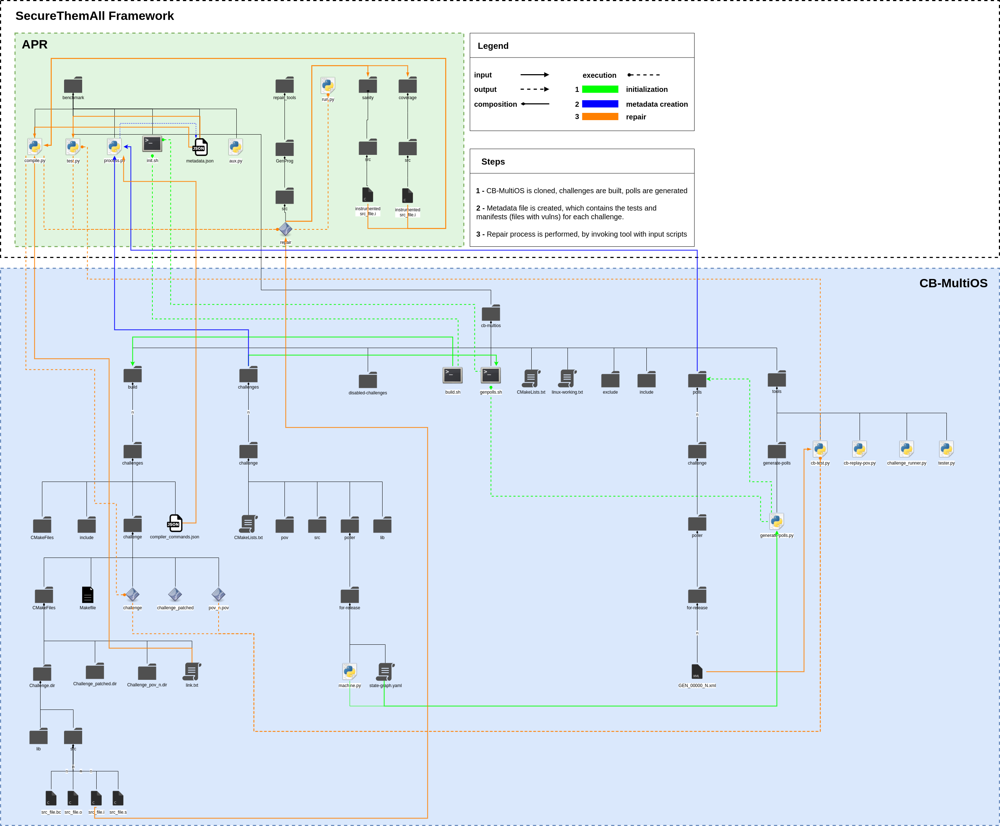

# SecureThemAll
Automatic Repair Framework based on Cyber Grand Challenge Event Corpus modified for Linux

###### This project is under development. The current status supports GenProg and works on Linux OS. The repair tools to be added are Angelix, RSRepair, SearchRepair, SOSRepair, MUT-APR, Prophet, SPR, DeepFix.

---
**Disclaimer**:

* I don't have any particular expertise with CMake, therefore, there might be better/simpler ways to implement the link between the tools and DARPA's CGC Event Corpus. If you know other approach, post an issue related to it.
---

### Notes

---
These notes might save you some time:

* The script ```repair.py``` at the end of the run will ```make clean``` and ```make``` to remove the changes the tools apply to the binaries. If that is not performed by the script, there are big chances that in the next run the tests will fail. If that happens run the script ```make_cb.sh``` in the ```benchmark``` folder to have a fresh challenge binary.
---


## Framework 



## Getting Started

These instructions will get you a copy of the project up and running on your local machine for development and testing purposes.

### Prerequisites

Install the necessary dependencies for cb-multios and GenProg before running the project.
<br/>
##### Software:
* [Python (2.7.17)](https://www.python.org/)
* [Python (3.7.5)](https://www.python.org/)
* [GenProg v3.2](https://github.com/squaresLab/genprog-code.git)
* [cb-multios](https://github.com/trailofbits/cb-multios.git)

#### 1) Clone this repo with submodule
``` console
$ git clone --recurse-submodules -j8 https://github.com/epicosy/SecureThemAll.git
```

Or

``` console
$ git clone https://github.com/epicosy/SecureThemAll.git
$ cd SecureThemAll
$ git submodule update --init --recursive
```

#### 2) Install Prerequisites

#### 3) Configure the project
Execute the ```init.sh``` in the folder ```benchmark```.
The script builds the challenges and POVs, generates the polls and creates the file ```metadata.json``` which is used by the scripts used by the repair tool.

``` console
$ ./init.sh
```

## Usage
``` console
$ python repair.py -c BitBlaster
```

By default, the count of generate polls is 100. The number can be changed in the ```benchmark\cb-multios\genpolls.sh``` script.

The number of positive and negative tests (Polls and POVs respectively) can be supplied with ```--pos_tests``` and ```--neg_tests``` arguments to the repair script.

``` console
$ python repair.py -c BitBlaster ---pos_tests 50 --neg_tests 1
```

## Challenges
The initial set of challenges considered for the framework are the ones listed in the ```linux-final.txt``` file from ```benchmark``` folder. The file was created by choosing the challenges in the ```linux-working.txt``` file from the **cb-multios** project and from those excluding the ones that contain extra folders (cb, include, support) and challenges that have vulns in the header source files, with the purpose to eliminate complexity and have a simple baseline.

To list the challenges covered, execute:

``` console
$ python repair.py -ls
```